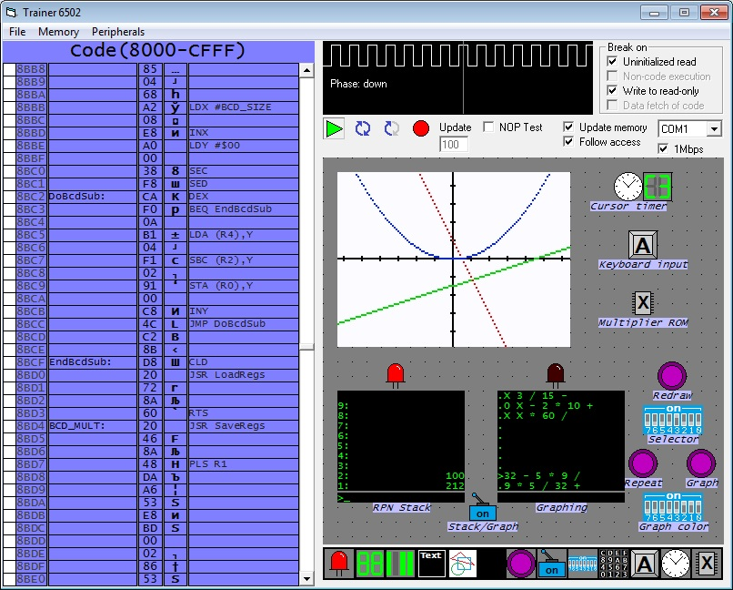
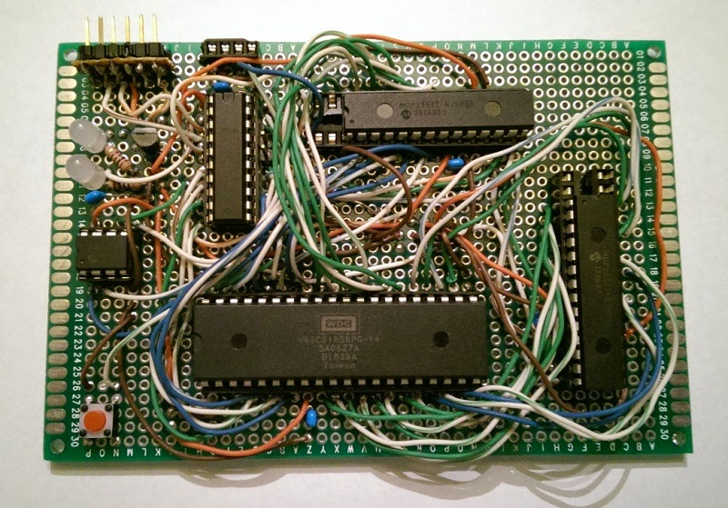

# 6502 Virtual Trainer
This is a system of virtual peripherals for a physical 6502 microprocessor. The host software running on the PC lets you drag and drop peripherals like LEDs, screens, buttons, and switches and map them into the 6502's memory space. A physical 6502 connects to the host software over serial through an MSP430 microcontroller which relays memory accesses between the PC and 6502. RAM and ROM are also virtualized on the PC, so you can pause the 6502 and examine or modify memory at any time. This system allows you to run programs on a real 6502 while relying on the PC for all memory, input, and output.

